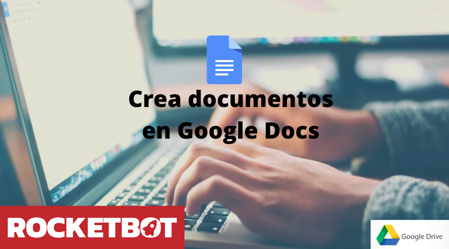

# Google Docs
  
Módulo para controlar o Google Docs  

*Read this in other languages: [English](Manual_GoogleDocs.md), [Português](Manual_GoogleDocs.pr.md), [Español](Manual_GoogleDocs.es.md)*
  

## Como instalar este módulo
  
Para instalar o módulo no Rocketbot Studio, pode ser feito de duas formas:
1. Manual: __Baixe__ o arquivo .zip e descompacte-o na pasta módulos. O nome da pasta deve ser o mesmo do módulo e dentro dela devem ter os seguintes arquivos e pastas: \__init__.py, package.json, docs, example e libs. Se você tiver o aplicativo aberto, atualize seu navegador para poder usar o novo módulo.
2. Automático: Ao entrar no Rocketbot Studio na margem direita você encontrará a seção **Addons**, selecione **Install Mods**, procure o módulo desejado e aperte instalar.  

## Como usar este módulo

Antes de usar este módulo, você deve registrar seu aplicativo no Google Cloud Portal.

1. Faça login com uma conta do google no seguinte link: https://console.cloud.google.com/projectcreate?previousPage=%2Fhome%2Fdashboard
2. Preencha o formulário e depois pressione Criar
3. No Menu de Navegação (Esquerda), entre em API e Serviços
4. Na seção superior, entre em "+ HABILITAR API E SERVIÇOS"
5. Procure por "Google Docs API", selecione e finalmente habilite
6. Novamente vá para Menu de Navegação (Esquerda) > API e Serviços > Credenciais
7. Pressione o botão "Configurar tela de consentimento". No tipo de usuário, escolha se possível "Interno". Se não estiver disponível, você deve selecionar "Externo" e preencher os campos obrigatórios.
8. Preencha os campos obrigatórios com as informações do seu aplicativo e pressione Salvar e continuar.
9. Na etapa 2, clique em "Adicionar ou remover permissões", filtre "Google Docs API", marque todas as permissões e pressione Atualizar. Em seguida, pressione Salvar e continuar.
10. Volte para "Credenciais"
11. Pressione Criar Credenciais > ID do cliente OAuth, selecione como Tipo de Aplicativo: Aplicativo de desktop, coloque um nome e crie.
12. Baixe o arquivo JSON de credenciais.
13. Se o aplicativo foi criado como "Externo", você deve ir para Menu de Navegação (Esquerda) > Tela de Consentimento e adicionar usuário na seção "Usuários de teste"

## Descrição do comando

### Configurar credenciais G-Suite
  
Obtenha permissões para manipular o Google Docs com o Rocketbot
|Parâmetros|Descrição|exemplo|
| --- | --- | --- |
|Caminho do arquivo de credenciais|Selecione o arquivo de credenciais do G-Suite|Path|
|Atribuir resultado à variável|Atribua o resultado da conexão a uma variável|resultado|

### Novo documento
  
Cria novo documento Google Docs.
|Parâmetros|Descrição|exemplo|
| --- | --- | --- |
|Nome do documento|Nome do documento a criar|Nome: |
|Variável onde o ID será salvo|Variável onde o ID do documento criado será salvo|resultado|

### Escreva no documento
  
Escreva no documento do Google Docs
|Parâmetros|Descrição|exemplo|
| --- | --- | --- |
|ID do documento|Insira o ID do documento do Google Docs|1XfKS0_ftXfKSpO_iX6udViX6udViX6udV_iX6udV|
|Escreva texto|Texto para escrever no documento do Google Docs|Lorem ipsum dolor sit amet, consectetur adipiscing elit.|

### Ler documento
  
Ler um documento Google Docs
|Parâmetros|Descrição|exemplo|
| --- | --- | --- |
|ID do documento|ID do documento do Google Docs|1XfKS0_ftXfKSpO_iX6udViX6udViX6udV_iX6udV|
|Variable onde o resultado será salvo|Variável onde o resultado da leitura do documento será salvo|resultado|

### Adicionar imagem
  
Adicione uma imagem ao documento
|Parâmetros|Descrição|exemplo|
| --- | --- | --- |
|ID do documento|ID do documento ao qual a imagem será adicionada. O ID do documento está na URL do documento|1XfKS0_ftXfKSpO_iX6udViX6udViX6udV_iX6udV|
|Url da imagem|Url da imagem que será adicionada ao documento|https://example.com/image.jpg|
